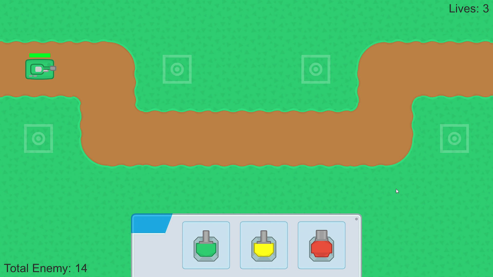
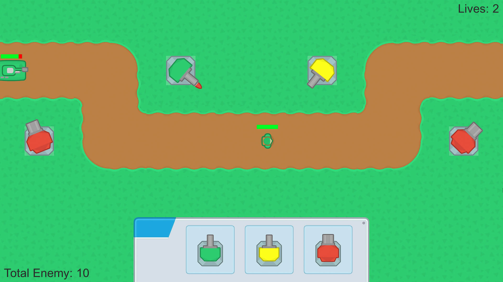
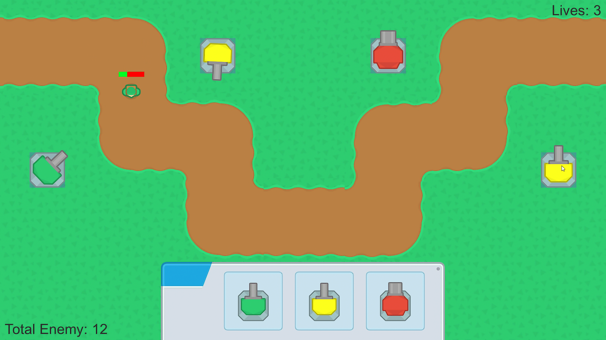
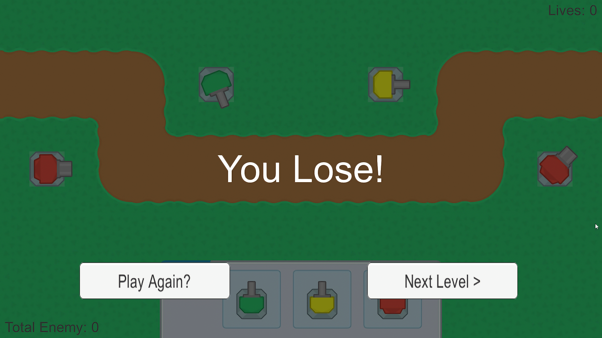

[![LinkedIn][linkedin-shield]][linkedin-url]

[linkedin-shield]: https://img.shields.io/badge/-LinkedIn-black.svg?style=for-the-badge&logo=linkedin&colorB=555
[linkedin-url]: https://www.linkedin.com/in/evanderchristiandumalang/

# 2D Tower Defense Game

## Features

1. Enemy, Projectiles
2. 2 Level
3. UI (Enemy, Lives, Win and Lose Condition)
4. Sound effect
5. Continuous Play

### Built With

* [![Unity][Unity.com]][Unity-url]

[Unity.com]: https://img.shields.io/badge/Unity-FFFFFF?style=for-the-badge&logo=unity&logoColor=black
[Unity-url]: https://unity.com/

## Documentation

### Game Preview
    

### Demo

## Prerequisite

- [Unity 2018.3.3 ](https://unity3d.com/get-unity/download/archive)

## Installation

- Add [Unity](https://store.unity.com/front-page?check_logged_in=1#plans-individual) to your machine

- Add this project folder on Unity and run

## Contributing

Contributions are what make the open source community such an amazing place to learn, inspire, and create. Any contributions you make are **greatly appreciated**.

If you have a suggestion that would make this better, please fork the repo and create a pull request.

## License

All the code available under the MIT licenses. See [LICENSE](LICENSE).

